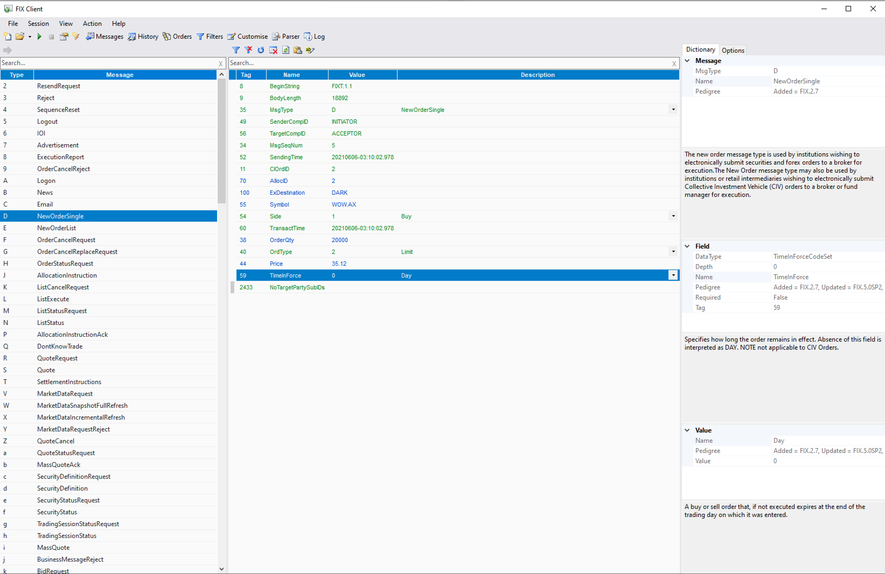

# FIX Client

## Synopsis

FIX Client is a Windows desktop program designed for manually testing [FIX protocol](https://www.fixtrading.org/online-specification/) end points. It can simulate both initiator and acceptor behaviour. FIX Client is written in C# using Winforms and is built on a C# FIX library that can be used standalone to build other programs.

***
## Releases

If this is the first time you've run FIX Client follow the installation instructions below.

### Stable
This branch is actively developed. The main difference between this and the legacy 4.x branch is that the data dictionary is now built on the FIX Orchestra standard.
* Download the latest release [5.3.0](https://github.com/GaryHughes/FixClient/releases/tag/v5.3.0)
* The libraries FIX Client is built upon are available via nuget [here](https://www.nuget.org/packages?q=Geh.Fix).
    * Documentation for Fix.Dictionary can be found [here](Fix.Dictionary/README.md).
    * Sample code can be found in the [Examples.](https://github.com/GaryHughes/FixClient/tree/master/Examples)

### Legacy
This branch maintains historic functionality and is built on a FIX Repository based data dictionary.
* This branch is not actively maintained but bug fixes will be considered.
* Download the latest stable release [4.0.0](https://github.com/GaryHughes/FixClient/releases/tag/v4.0.0)

***
## Installation

* FIX Client is distributed as .NET single file application, just download FixClient.exe from a [release](https://github.com/GaryHughes/FixClient/releases) and run it.
* For releases prior to 5.1.0 Install the [.NET 5.0 Desktop Runtime](https://dotnet.microsoft.com/download/dotnet/thank-you/runtime-desktop-5.0.5-windows-x64-installer)
    * **NB** FIX Client is not compatible with **.NET 5.0.4** Please see [here](https://github.com/GaryHughes/FixClient/issues/2) for details.  

***
## Building
### Command Line

* Install the [.NET 10.0 SDK](https://dotnet.microsoft.com/en-us/download/dotnet/thank-you/sdk-10.0.100-windows-x64-installer)
* Clone this repository and change into the repository root directory.
* On the command line type `dotnet publish -c Release`
* The resulting executable can be retrieved from `FixClient/bin/Release/net10.0-windows/win-x64/publish/FixClient.exe` 

### Visual Studio
* Install [Visual Studio Community Edition 2022](https://visualstudio.microsoft.com/vs/community/)
* Open `Fix.sln` in the repository root directory.
* Select `Build` -> `Publish FIX Client` from the menu.
* Click the `Publish` button.
* The resulting executable can be retrieved from `FixClient/bin/Release/net9.0-windows/win-x64/publish/FixClient.exe` 

***
## Acknowledgements

This repository includes parts of the www.fixtrading.org XML Repository Copyright (c) FIX Protocol Ltd. All Rights Reserved.
